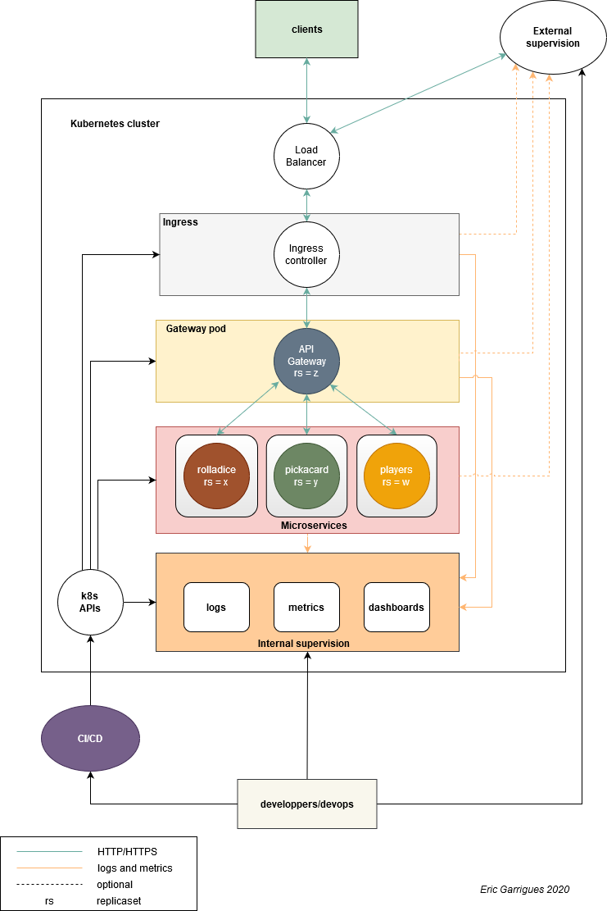
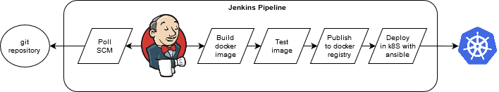
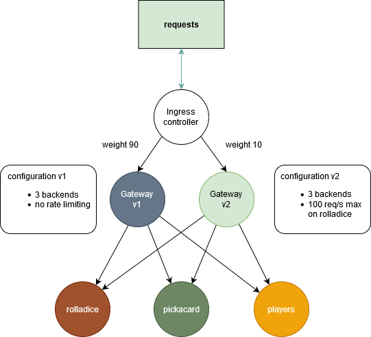
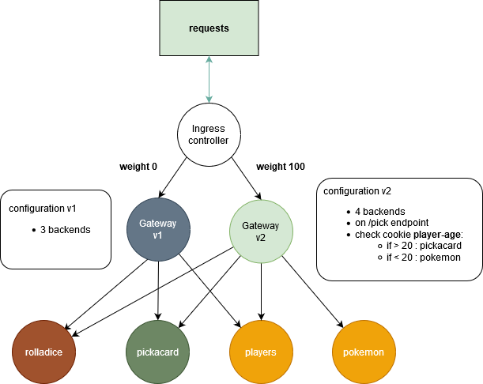

# Casino : API gateway case study

The main goal of this project is to document the selection, deployment, maintenance and supervision of an API Gateway in front of some microservices inside a cloud stack.

**Some needed setup like having a working jenkins server, a docker environnement, a kubernetes cluster and the associated configurations are outside the scope of this document.**

You can find an example of the packaging and deployment in the [Building and deploying Krakend](./BUILDING.md) file.

### Requirements

It must be :
 - stateless
 - exposed on the internet
 - in a static binary form
 - deployable in a cloud environement
 - available 24/7
 - scalable to support at least 1000 requests per second
 - deployable by any developer or devops

Also i'll add some more when choosing the software :

- it needs to be able to expose its statistics (req/s, load, connected clients,...) and logs so we can export them into a supervision system.
- it has to be well documented and maintained

## Selection of the API Gateway software

A presentation and comparison of some API gateway software can be found here : [fineleap api gateway talk](https://engineering.finleap.com/pdf/finleap_talk_api_gateway.pdf)

Based on the above requirements, i've chosen the [**Krakend API Gateway**](https://www.krakend.io) which is written in Go language and seems to fulfill all of them.

## Selection of a cloud technology

I've choosen to **deploy it in a kubernetes cluster** as it's today a natural choice for microservices oriented applications.

**Anyway, no specific provider (GCP, AWS, Azure) related code** will be produced here to ensure that it can run everywhere.

## Architecture of the application stack in Kubernetes

## CI/CD stack and pipeline

The CI/CD is based on 4 components :

- a git repository
- a jenkins server
- docker for packaging
- ansible for deployment in kubernetes

### Requirements for developers and devops

The only requirement is to be able to commit and push modification in a git repository.

### Pipeline

The complete pipeline is this one :

1. a developer make a merge request for a configuration change
2. after review by other developers the code is merged
3. on jenkins, a poll SCM job is triggered
4. if step 3 is a success, the docker container is built by jenkins
5. if step 4 is a success, the image is tested on the jenkins server
6. if step 5 is a success, jenkins deploys the new image in the registry
7. if step 6 is a success, jenkins launches an ansible playbook initiating a rolling update of the pod in k8s

## Monitoring of the application

The monitoring of the state of the gateway and the microservices behind it must be done :

- inside the kubernetes cluster with the collected metrics to ensure that the autosaling policies (cpu,mem,requests/s) are working as expected.
- from recurrent api calls (HTTP/HTTPS) from an external source (pingdom,statuscake,datadog,...)
- from application metrics and logs observation with an in house monitoring system or from a saas service (datadog,dynatrace,new relic,...) where the logs and metrics are forwarded.

### Proposed in house monitoring stack

Today, most application monitoring stacks are based on those 4 components :

- A time series database for the application metrics collection coupled with an alerting engine.
- A log collector and aggregator receiving all output and traces
- A dashboard creation and presentation service
- An alerting, scheduling and escalation policies service

So for our application supervision i propose this stack

- **Prometheus** for the metrics and alerting definition
- **ELK** stack (elasticsearch + logstash + kibana) for the logs
- **Grafana** for the dashboards
- **Pagerduty** as the external alerting service

## Deployment testing

To ensure that new configuration changes of the API Gateway are not impacting all customers in case of implementation error, some **Blue/Green**, **canary** and **A/B** testing environments must be deployed in the kubernetes environment.

The best way to do it for me is in at ingress controller level as you can :

- ensure that if a API Gateway is not responding anymore it will be invalidated and the traffic will stop being forwarded to it.
- set a load-balancing traffic policy based on weight or load for Blue/Green and canary testing.
- inject an HTTP header or a **cookie** to activate/deactivate a feature or endpoint **at runtime** (kill switch).

**Of course, this should be automated through the CI/CD as well**

### Blue/Green

Using a simple 0 or 100 weight policy at the ingress level is a very simple way to have a stateless Blue/Green environment with an easy switching between both allowing fast rollbacks.

### Canary

Canary testing can be implemented using the same method as the Blue/Green one but with non binary weights allowing only a fraction of the traffic to flows to the new version of the service.

Here, we are redirecting 10% of the whole traffic to the newly configured service in front of a new pod implementing a threshold for a maximum of requests per seconds on the **roll** endpoints.

The rest of the traffic flows to the previous service and pod.

Once we are sure that the behavior for the new version is working as expected :

- we change weight in the ingress controller to 100% on the new version.
- we remove the old gateway service and destroy the associated pod.

### A/B

A/B testing is often used to test new features that will be activated but only for a **controlled subset** of the customers and the API Gateway is a great place to put apply it.

In our case we are both doing BLue/Green at the ingress level and canary testing of a new feature (sending pokemons instead of poker cards) at the API Gateway level.

### Performances profiling

We can use the [hey](https://github.com/rakyll/hey) program to test the application performances from outside or from a container in the kubernetes cluster.

This test can be integrated into the CI/CD pipeline for a staging environment to ensure that no performance regression issues arise after a new version is pushed.
